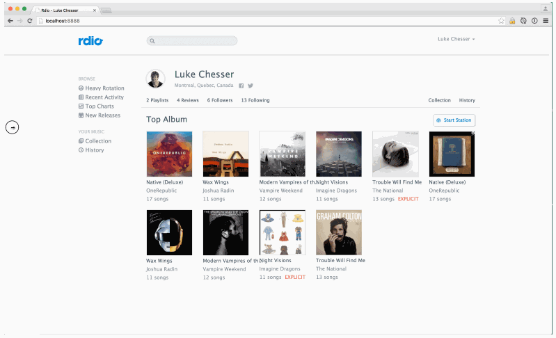

**TP Responsive Web Design**
----------------------------

1. Install Bootstrap

2. Center  elements on the page thanks to a bootstrap container

3. Use the bootstrap grid to define the elements width

4. Use grid classes (col-xs-* / col-md-* etc.) to display successively 6 albums in a wide screen, 4 for the tablets and 3 under.

5. Use Bootstrap for :
	- Hiding the left column on mobile and on tablet in portrait mode
	- Align the links Collection et History to the right when free space is available
	- Set the menu (at top right)
	- Display the icons in the menu

6. Replace all pixels font sizes by relative sizes (em ou rem)

7. Set the viewport for mobiles

8. Use medias queries to :
	- Hide the search field when the space is insufficient
	- Hide twitter and facebook icons on mobile
	- Present albums 2 by 2 when the screen is below 450px

9. Adjust the font-size at the 3 following break points : 1400px (bigger) / 600px (small) / 450px (smaller)

10. Redimension the browser's windows and test that the page is visually coherent on all résolutions. Do the necessary adjustment with media queries